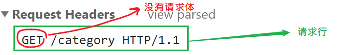
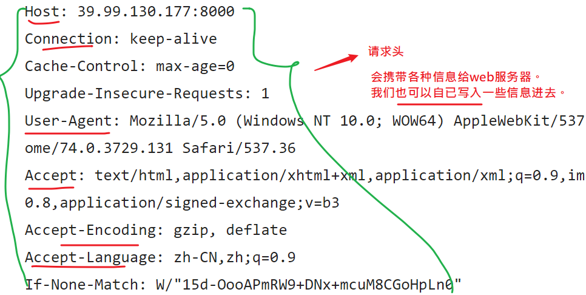
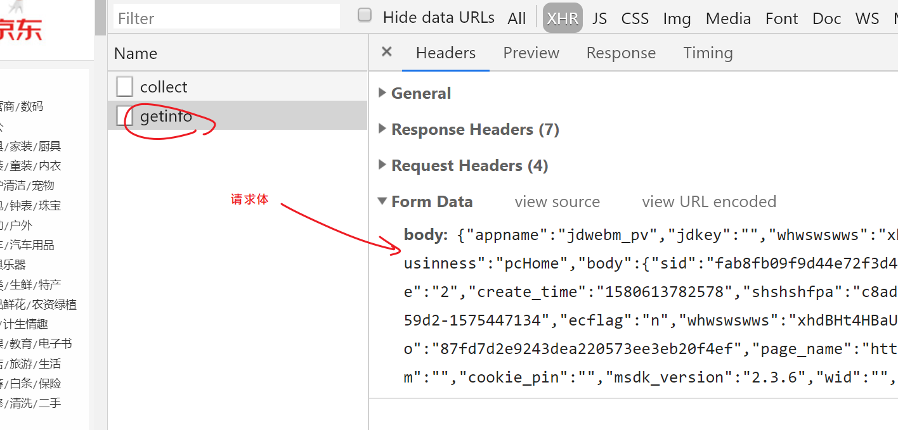
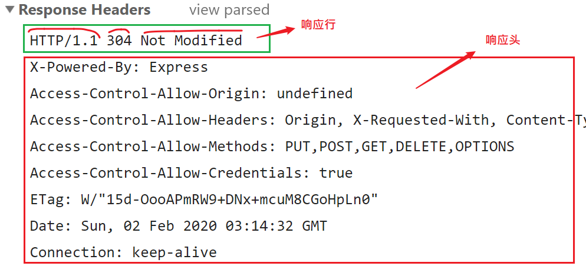
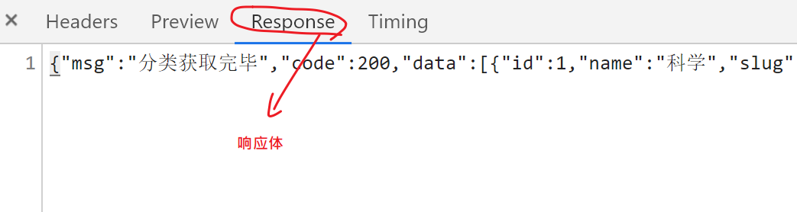
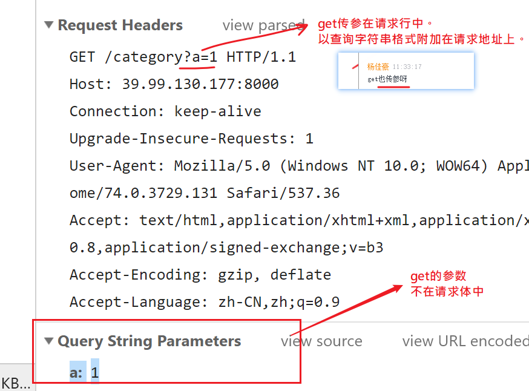
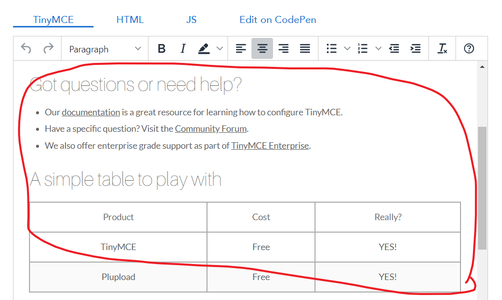
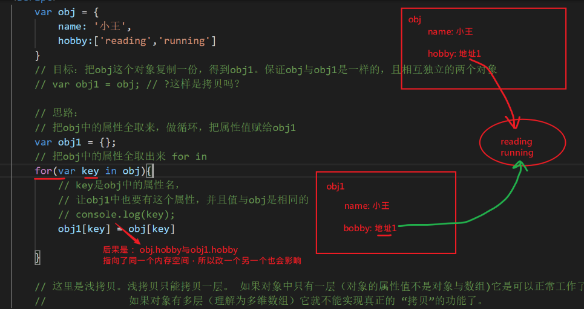
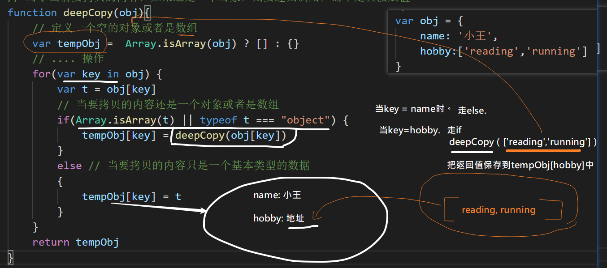

2020年2月2号 星期一 上午

- 作息时间

  上午：9：00  - 12：00

  下午：2：00 -  5:00

  晚上：不用上直播，群里答疑

  注意：

  - 整点上课；

  - 45下课：休息15分钟；

- 调试设备
  - 直播间有5s延时。
  - 网速很重要
  - 直播提问不能发图，只能打字。
  - 如果进来是黑屏，多刷几次。或者试试手机进来。
  - [chrome如何开启flash](https://jingyan.baidu.com/album/ca41422f013b841eaf99ed4b.html?picindex=5)
  - 如果显示直播结束，从这里进去：https://xuexi.boxuegu.com/construe.html?id=2426

- 复习ajax
  - template
  - http协议
  - 分页
  - iframe
  - 富文本框
  - ajax提交表单
  - 深拷贝（自已写写代码试试）
  - 大事件还没有讲完，会继续的。

> 试一试： 把大事件的后端接口地址可以改成:[http://39.99.130.177:8000]([http://39.99.130.177:8000](http://39.99.130.177:8000/))

## 问题

问：

if (!confirm('你确定要删除吗？')) {         return       }  老师正在什么情况下 可以用这种代码语法啊？  能举几个 栗子吗？


答：主要思想是提前结束处理流程：一旦发现有不满足执行条件的，就立即返回。 例如：用户登陆，如果没有输入密码，就不执行后面的流程。

```
if(password === '') {
     return
}
```


问：

微博右下角有个0/200那个功能。

```
$("#input").keyup(function(){

var len = $('#input').val().length;

if(len >200){
	$('#input').val(  $('#input').val().substr(0,199) )

}
})
```


问： 请求 报错 如何判断 是前端的问题 还是后端的问题 

答： 从前端的角度：

1. 有没有网络。
2. postman测接口
   1. 有没有权限。有些接口必须是登陆用户（或者是管理员）才能调用
   2. 核实发给后端的参数：
      1. 个数:
      2. 类型：字符串，数值的...
      3. 参数名: 写错了...
      4. 发送的方式：get,post,......
   3. 如果参数没有问题，也能在postman中收到接口的反馈，说明接口是通的。说明前端没有问题。

## 复习-http协议

http协议：

- 规定浏览器与web服务器如何**说话**

- 浏览器主动与web服务器说话：叫请求

  每次请求要有三个东西：

   - 请求行。只有一行，最简单啦 。由三个部分构成：请求方式，请求路径，协议及版本

     

   - 请求头

     作用：告诉web服务器一些额外的信息。

     

     在写原生ajax时:

     ```
     xhr.setRequestHeader('content-type','applica........')
     ```

     

   - 请求体（可选的。get请求就没有请求体）

     向web服务器传递数据。例如：用户注册的用户名，密码；文件上传时的文件; 

     

- web服务器回话给浏览器：叫响应

 

响应由三个部分



- 响应行

  协议及版本，  状态码， 状态码的说明

- 响应头

  web服务器告诉给浏览器的一些信息。

- 响应体

  本次对话从web服务器上获取的具体数据。

  

### get请求的参数

get传参不在请求体中。




## 复习-富文本编辑器

富文本框是什么？

- 比普通文本框更强大的编辑器。可以设置字体的格式，插入图片.....
- 本质是js库
- 原理是通过html代码来设置内容。



[tinyMCE](https://www.tiny.cloud/docs/demo/basic-example/)

步骤：

1. 引入.js

2. 初始化

   ```
   tinymce.init({
   	selector: '#mytextarea'
   });
   ```


最重要的两个动作：

1. 从富文本框中获取内容

   tinymce.activeEditor.getContent()

2. 设置内容给富文本框

   tinymce.activeEditor.setContent("<p>ha<strong>h</strong>a</p>")

## iframe

## iframe标签

iframe 元素会创建包含另外一个文档的内联框架，它一般配合a标签的target属性一起使用。

它会创建一个“容器”，这个容器中可以引入另一个独立的.html文件。

```html
<body>
    <div class='container'>
        <a href="1.html" target="main">1</a>
        <a href="http://www.baidu.com" target="main_baidu">2</a>
    </div>
    <iframe src="1.html" name="main" frameborder="0" style="width:100%"></iframe>
    <iframe  name="main_baidu" frameborder="0" style="width:100%"></iframe>

</body>
```

注意：

- a标签的target值是iframe标签的name属性值
- iframe正常使用css设置样式


## ajax表单提交

在开发的过程，基本不用form自带的提交功能，而是用ajax去做提交。这样的话，form标签存在在的价值就不大了。

```
<!DOCTYPE html>
<html lang="en">
<head>
    <meta charset="UTF-8">
    <meta name="viewport" content="width=device-width, initial-scale=1.0">
    <meta http-equiv="X-UA-Compatible" content="ie=edge">
    <title>Document</title>
</head>
<body>
    <!-- action:指定form中的数据要交到哪里？
    method:用来指定交数据的方式 -->
    <form id="form" action='http://ajax.frontend.itheima.net:3006/api/addbook' method="post" target="_blank">
        <div class="required inline  field">
            <label>书名</label>
            <input name="bookname" placeholder="书名" type="text">
        </div>
        <div class="required inline  field">
            <label>作者</label>
            <input name="author" placeholder="作者" type="text">
        </div>
        <div class="required inline  field">
            <label>出版社</label>
            <input name="publisher" placeholder="出版社" type="text">
        </div>
        <button class="ui button blue submit" type="submit">添加</button>
    </from>
    <!-- 用表单来提交： -->
    <!-- 1. 要给表单元素设置name。并且这个值要与接口中要的参数保持一致 -->
    <!-- 2. 它会导致页面跳转 -->

    <!-- 如何希望用ajax技术来提交数据，则表单存在的意义就是用来快速收集用户的填入的信息。 -->
    <script src="./jquery-1.12.4.min.js"></script>
    <script>
        $(function() {
            $('#form').submit(function(e) {
                console.log(e);
                e.preventDefault()
                $.ajax({
                    url: 'http://ajax.frontend.itheima.net:3006/api/addbook',
                    type: 'post',
                    data: $('#form').serialize(), 
                    // 快速获取表单元素的值。
                    // bookname=11&author=22&publisher=222
                    success:function(res){
                        console.log(res);  
                    }
                }) 
            })
        })
    </script>

</body>
</html>
```


## 深拷贝

### 浅拷贝




### 深拷贝




### 小结

- 深拷贝是一个面试比较常见的问题；
  - 必须要掌握用递归的写法实现深拷贝
  - 必须要能说明白 它与浅拷贝的区别

- 在开发中，我们一般会有现成的第三方的api来实现；

jquery中也提供一个方法用来做深拷贝

```
$.extend(true,新对象,旧对象)
```

lodashjs库中也有一个方法用来做深拷贝

https://www.lodashjs.com/docs/latest#_clonedeepvalue