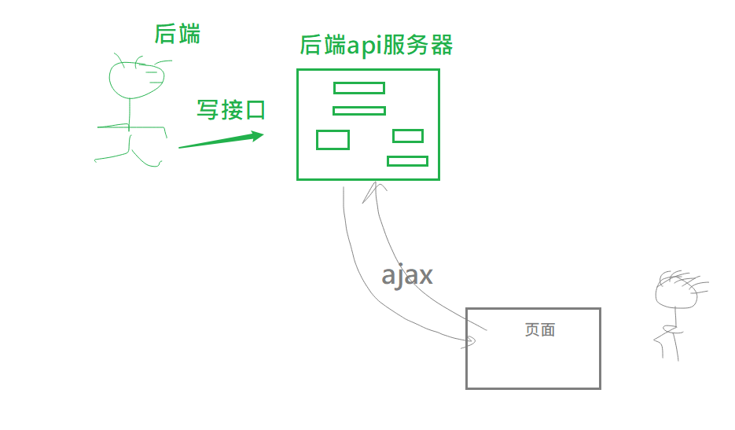
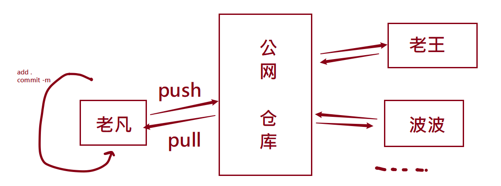
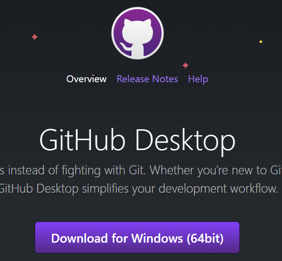
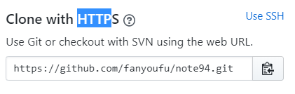
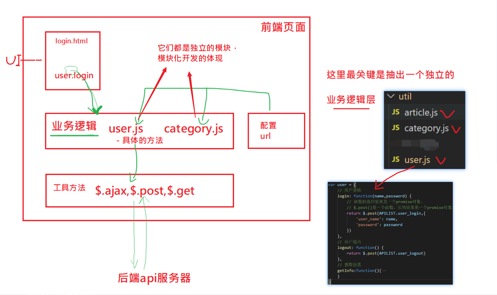

2020.2.3

复习及设备测试。大家可以**列出要复习重点**。

- ajax
- git/GitHub
- 大事件
- 欢迎大家提其它的问题

新手：

1. 不知道代码在哪里？
   1. 公司内部的代码下载下来也可能需要权限。或者是必须要加入对应的工作组才有权下代码。
2. 如何把代码跑起来？
   1. 我们一般只有下载前端代码的权利，而一个项目要跑起来可能是需要后端对应的代码支持。后端代码对前端是不友好的（例如java）：你看不懂，跑不起来。

3. 看不懂别人的代码？
   1. 别人的代码语法太高级了，用了很多新技术。导致你看不懂。
   2. 业务太复杂了。代码太多，太长，看不懂。
   3. 别人的代码写的太low了......
4. 不知道如何排错？**调试**
   1. 逻辑比较复杂
   2. 不知道如何去调试，如何输出中间变量，值.....
   3. 不知道如何去归因：是前端的错，还是后端的锅？


## 复习

### ajax

#### ajax整体

- 它是一种解决方案：它解决的问题是在不刷新页面的情况下，去与服务器进行交互，以提升用户体验。（场景：手机看新闻列表：**上拉加载更多新闻**）
- 它是前后端分离开发的基础。
  - 后端写接口
  - 前端调接口




#### 在开发中的使用

**选择一个库**

会选择一个库来调用方法实现ajax（我们具备手写的能力，但是，不用！）

两个选择：

- pc:         $.ajax()
- 移动端：axios

为什么在移动端不用jquery?

- 太大
- 在移动端的开发，主要是用vue,react等这些框架进行开发，而它们是数据驱动视图的，所以不需要用jquery来操作视图，也就没有必须引入jquery了。


**能看到接口文档**

没有接口文档，则ajax就没有办法去调用啦！！！

接口文档的示例：https://www.showdoc.cc/ajaxapi?page_id=3753516951471746

- 接口文档一般是后端写接口的同学的提供的。
- 接口文档一般是通过第三方工具(如：postman，https://www.showdoc.cc/。只要是接口测试软件就可以生成接口文档)生成的一个网页（也有可能是后端直接写在word，.txt中的....）


**做填空题**

一个ajax请求是有固定的格式的，而其中要填入的内容都是由接口文档中规定好的。

```javascript
$.ajax({
    url:'接口地址',     // 前端人员无法修改
    type:'请求的类型',  // 前端人员无法修改
    data:'发给接口的数据', // 前端人员按接口文档中对参数的要求要写入
    success:function(res){
		// res 就是接口给你的数据
    }
})
```


#### 目标要求

1. 原生的能写（开发中用不上，但是你得会，最低的要求：你要知道答案在哪里）：xmlHttpRequest.
   - get 带参数的
   - post带参数的
   - 简单的封装，写成类似于$.ajax()的这种格式
2. 简单的问题能了解
   1. http://api/xxxxxxxx?a=1&b=2&_t=143434224343 ie的get请求缓存
   2. 常见的http状态码
   3. 如何在开发者工作中检查请求和响应。具体就是如何查看请求行，头，体；响应行，头体；
   4. 如何使用postman测试接口？
3. 掌握$.ajax和axios的用法。
4. 理解传递参数的格式(是后端接口决定的)
   1. 普通键值对，      对应的请求头是：content-type:applicaton/x-www.........
   2. formData对象，对应的请求头是：content-type:applicaton/multy..formdat


### 复习 git

整体回顾：

- git是一个软件。要先安装，再使用。
- 它是做版本管理的软件。
- 它是所有程序员都应该掌握的工具。


#### 基本使用

	1. 建立仓库（git init 这里只针对本地仓库，就是你自已的电脑，自娱自乐，不涉及远程）
 	2. 把你的代码加入到仓库中，根据你的自已的实际情来决定是否要**形成一个版本** ，要通过`git commit -m "提交原因"`命令才能形成一个版本。
 	3. 重复： 修改->保存版本->修改->保存版本-->修改->保存版本........


#### 非常操作

- 代码恢复。
  - 从工作区
  - 从暂存区
  - 从仓库

#### 理解原理

- 三个区域
  - 工作区
  - 暂存区
  - 仓库
- 四种状态
  - 未跟踪
  - 已暂存
  - 已修改
  - 已提交


#### 远程仓库

实际开发一定会涉及远程仓库



	- 代码与其它人一起协作(如果你想向别人创建仓库中推送代码：push操作，要得到别人的允许)。
	- 市面上有名的两个远程仓库：github，码云
	- 大厂都自已的代码仓库。黑马也有。

>  Your branch is ahead of 'origin/master' by 1 commit.
>
> 你本地的分支领先于远程仓库一次提交。换句话，本地代码比较新，远程代码比较旧。

#### 分支概念

今天下午课结束之后，会发分支的预习资料。大家先自已预习，在大事件项目中，我们会用到分支。


### github

整体认识：

- 它是一个网站。全球最大的程序员交友社区，在这里可以下载代码，项目（下载zip文件就可以了）。
- 它可以当作不要钱的远程仓库，与git配合使用。
- 它是一个客户端[软件](https://desktop.github.com/) （建议去试试）
- 


两种常规动作：

- 在github上建立仓库（相当于是远程仓库），再克隆到本地（本地仓库），远程仓库与本地同步
- 在本地建立了仓库，再推到github，远程仓库与本地同步


注意：本地与远程在通讯时，可以使用两种不同的协议：https,ssh




程序员福利：用它来建立个人站点。

做法：以`github用户名.github.io`的固定格式来创建一个仓库。


### DOM0 跟 DOM2  分别是什么

文档对象模型的两个版本（可以认为是jquery的不同的版本）

DOM2   >  DOM0

dom2中有很多新的语法，api等，但是浏览器对它们都是支持的（可能少量不同）

eg:

dom2级事件：addEventListener

dom0级事件：onclick = function(){}


### 程序员职业规则

- 程序员是可以做很久的，不是到了35岁就完了。
- 在前2-3年，要打好基础
  - 不要太在意 工资（+- 2K）
  - 要在意：工作的内容，采用的技术，是否能接触到NB的人，项目..... , 自已有没有技术上的进步
  - 在小，大厂都没有太大的关系。
  - **时刻准备跳进大厂**

- 3-5年， 进入头部互联网公司

  - 见世面....

  - 真的到了年纪大了

    - 可以干到老
    - 拿一笔养老的钱，再出来(创业型，转行...)

    

### 正面的程序员

1. 多学。注意，参加工作了，每天都做不完的事，没有办法学。
2. 会人际。情商高。


### 大事件

当前要做的：

- 按你自已的IP地址，修改util/config.js中的配置的基地址
- 在自已的电脑上，把后端启来，前端代码运行起来。

后续要做的事

- 添加文章时，文章的图片预览功能
- 文章编辑功能；
- 游客的功能；


#### js代码的结构





休息15分钟，16:15回来

